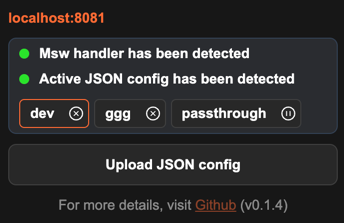

<p align="center">
  
  
  
</p>

<h1 align="center">Mock Service Worker DevTools Extension</h1>


[](https://www.npmjs.com/package/@msw-devtools/connect)
[](https://chrome.google.com/webstore/detail/jkclaelcdjjledfendcippjbhngkhkpm)

> **⚠️ WARNING: Pre-release Version**  
> In this pre-release version, every update clears the configuration storage!  
> Be cautious and make sure to save your JSON configurations locally to avoid losing them. 💾

## Overview

This Chrome extension simplifies working with [Mock Service Worker (MSW)](https://mswjs.io/). Instead of manually writing handlers, you can upload JSON files with mock requests, manage multiple configurations, and switch between them seamlessly. 🛠️

## Key Features 🌟

### 📂 JSON Import

Easily upload JSON files containing mock request configurations.


### 🔄 Multi-JSON Support

Switch seamlessly between multiple JSON configurations within the same host environment.



### 🚀 Pass-Through Mode

Enable pass-through mode to bypass JSON config and send requests directly to the server
even if configurations are uploaded.


## Motivation 💡

This extension is a game-changer for both developers and QA testers working with [MSW](https://mswjs.io/). 🧑‍💻👩‍💻  
Instead of manually defining handlers for every request, you can now upload pre-configured JSON files, whether it's a single file or multiple files for different scenarios. Switching between configurations is quick and easy, making this tool highly efficient for various development and testing workflows. 🚀

## Get started 🚀

### Installation

```bash
npm install @msw-devtools/connect --save-exact
```

### Integrate to existing MSW setup

> We assume that you are already familiar with [Mock Service Worker (MSW)](https://mswjs.io/) and have
> set up your project to work with it. If not, please visit the official [MSW](https://mswjs.io/) website for guidance.

Just add the response resolver handler from `@msw-devtools/connect`

```javascript
import { http } from 'msw'
import { setupWorker } from 'msw/browser'

import { createResponseResolver } from '@msw-devtools/connect'

const handlers = [http.all('*', createResponseResolver())]

setupWorker(...handlers).start({
  onUnhandledRequest: 'bypass'
})
```

### Install Chrome Extension

Chrome Extension is not yet published to Chrome Web Store, because it's in waiting for review.

[](https://chrome.google.com/webstore/detail/jkclaelcdjjledfendcippjbhngkhkpm)

You can only install it downloading the build and [loading it as an unpacked extension](./packages/extension/README.md).

[](https://github.com/vkruglikov/msw-devtools-extension/releases/tag/%40msw-devtools%2Fextension%40latest)

### Upload JSON Config to extension

[@msw-devtools/json-config](./packages/json-config/README.md)

### See the demo

[@msw-devtools/demo](https://vkruglikov.github.io/msw-devtools-extension/)

## Roadmap Features 🚧

### Edit json config in the DevTools

Currently, you can only upload JSON files, but you can't edit them in the DevTools.

### Upload multiple JSON config at once

Currently, you can only upload one JSON file at a time, because
it simplifies the process of validation.

### Multi window support

Currently, you can use multi tabs with different configurations per host, but only one browser window is supported.

### Early request interception

Currently, requests sent before the extension is initialized are not intercepted by JSON handlers.
